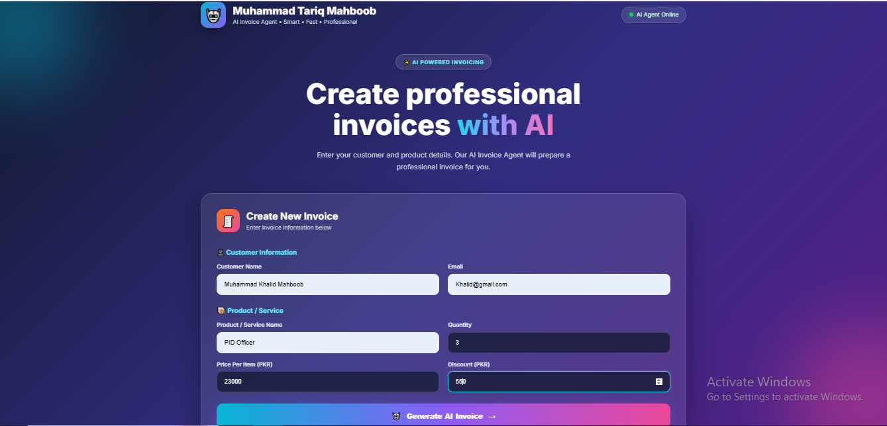

# 🤖 AI Invoice Agent

A modern and professional **AI-powered Invoice Generator** built with **HTML, CSS, JavaScript, Python, Flask, and Google Gemini AI**.

The application allows users to generate professional invoices, calculate totals automatically, receive an AI-generated invoice summary, and download the invoice as a PDF.

---

## 🚀 Live Demo

👉 **[AI Invoice Agent – Live Demo](https://ai-invoice-agent-one.vercel.app/)**

---

## 📸 Project Preview



---

## 📌 About the Project

**AI Invoice Agent** is a web-based invoice generation application designed to simplify the process of creating professional invoices.

Users can enter customer and product information, and the application automatically calculates:

* Quantity
* Item price
* Subtotal
* Discount
* Final total
* Invoice number
* Invoice date

The project also integrates **Google Gemini AI** to generate an intelligent invoice summary.

---

## ✨ Features

* 🧾 Professional Invoice Generator
* 🤖 AI-powered Invoice Summary
* 🔢 Automatic invoice number generation
* 📅 Automatic invoice date
* 🧮 Automatic subtotal calculation
* 💰 Discount calculation
* 📊 Automatic final total calculation
* 📥 Download invoice as PDF
* 🎨 Modern and responsive user interface
* 📱 Responsive design
* ⚡ Fast invoice generation
* 🔐 Environment variable support for API keys

---

## 🛠️ Technologies Used

### Frontend

* HTML5
* CSS3
* JavaScript
* jsPDF

### Backend

* Python
* Flask
* Flask-CORS
* ReportLab

### Artificial Intelligence

* Google Gemini AI
* Generative AI

### Development Tools

* Visual Studio Code
* Git
* GitHub
* Vercel

---

## 🔄 How It Works

### 1️⃣ Enter Customer Information

Enter:

* Customer Name
* Customer Email

### 2️⃣ Enter Product or Service Details

Enter:

* Product / Service Name
* Quantity
* Price
* Discount

### 3️⃣ Generate Invoice

Click:

**Generate AI Invoice**

The application automatically calculates the invoice totals and creates the invoice preview.

### 4️⃣ AI Invoice Summary

The Python backend communicates with **Google Gemini AI** to generate an intelligent summary of the invoice.

### 5️⃣ Download PDF

Click:

**📥 Download Invoice PDF**

to download the generated invoice as a PDF document.

---

## 📄 PDF Invoice

The application uses **jsPDF** and **ReportLab** to support professional invoice PDF generation.

The generated invoice contains:

* Invoice Number
* Invoice Date
* Customer Information
* Product / Service
* Quantity
* Price
* Subtotal
* Discount
* Final Total
* AI Invoice Summary

---

## 🤖 AI Invoice Summary

The project uses **Google Gemini AI** to analyze the invoice information and generate a concise summary.

This demonstrates the integration of **Generative AI with a practical business application**.

---

## 🔮 Future Improvements

Possible future improvements include:

* 📧 Email invoice directly to customers
* 💾 Save invoice history
* 🗄️ Database integration
* 👤 User authentication
* 📊 Invoice dashboard
* 🌐 Multi-language support
* 💳 Online payment integration
* ☁️ Fully cloud-based AI backend
* 📱 Progressive Web App (PWA)
* 📈 Business analytics and reports

---

## 📂 Project Structure

```text
AI-Invoice-Agent/
│
├── app.py
├── index.html
├── script.js
├── style.css
├── ai-invoice-agent.png
├── README.md
├── .gitignore
└── .env
```

> ⚠️ The `.env` file is used for sensitive API keys and should never be uploaded to GitHub.

---

## 👨‍💻 Developer

**Muhammad Tariq Mahboob**

Former Air Force Instrument Supervisor & Mechanic
Student of AI, Web 3.0 & Metaverse

### Skills & Technologies

HTML • CSS • JavaScript • TypeScript • Python • React.js • Next.js • Generative AI • Agentic AI

---

## 📜 License

This project is created for educational, portfolio, and development purposes.

---

## ⭐ Support

If you find this project useful, consider giving the repository a ⭐ on GitHub.

---

### Designed & Developed by

**Muhammad Tariq Mahboob**

🚀 *Former Air Force Instrument Supervisor & Mechanic → AI & Web Development Student*
